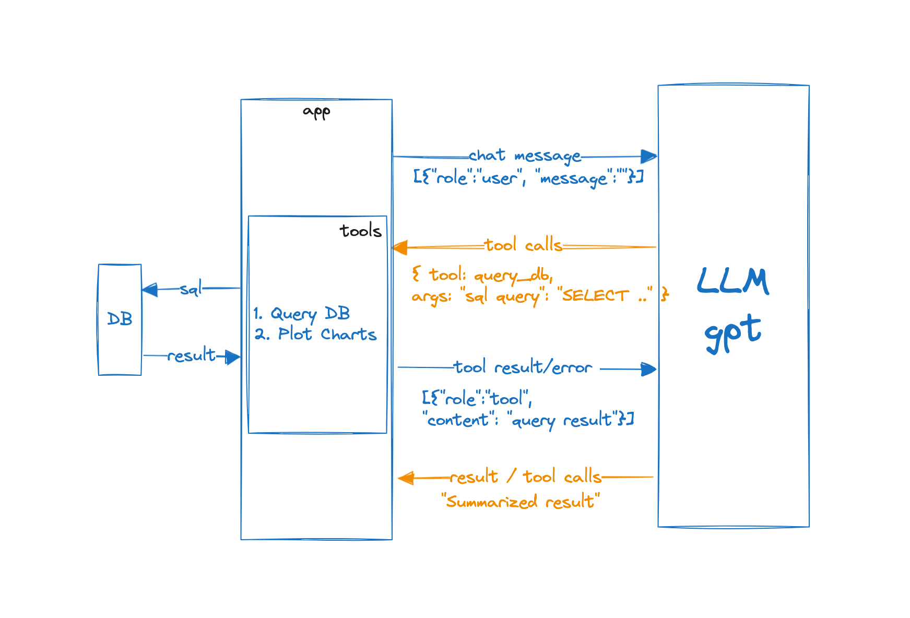

# Conversational AI with Function Calling for Data Analysis

## Overview

The chatbot is designed to provide data analysis insights from database based on a predefined schema. It is built using Chainlit and OpenAI's GPT-3.5-turbo-1106 model. The chatbot utilizes OpenAI function calling to decide when to use tools and in case of db error it retries.

https://github.com/crazycloud/data-analysis-llm-agent/assets/1109740/0ede2932-643c-4a2f-b557-40e9571ba841

## How to run it

```python
cd <repository>
pip install -r requirements.txt
chainlit run src/data-analysis-llm-agent/app.py --port 8002
```

## Available Tools

The chatbot has access to a range of tools, including:
Database Query: Execute database queries to retrieve data.
Plot Chart: Generate visualizations to help users understand data insights.

## Code

**app.py**: The main application file, which sets up the Chainlit framework and defines the chatbot's logic.  
**bot.py**: The chatbot class which handles conversation history, talking to llm and parallel function calling.  
**utils.py**: Utility functions for db introspection and format conversion.  
**tools.py**: Tool functions for executing database queries and plotting charts.  
**.env**: openai api key  

## Data

It uses simple sqlite3 database of movie and actors from https://github.com/slackhq/sqlite-python-connect/. The schema is very simple with only two tables but should work with more complex schema.

## How it Works

Here's a high-level overview of how the application works:

- The user sends a message to the chatbot.
- The response may include tool calls. Tool calls include fetching results from database or generating plots.
- The tool results are added back to the list of conversation messages. Everything including tool results, error messages are added to the conversation and sent back to llm to get a second response.
- The Execution loop is run for MAX_ITER times if each new response has a tool call.
- The chatbot sends the response back to the user, including any plots or tables generated by the tool calls.



## Key Takeaways

1. Importance of Foreign Key Constraints
   Providing foreign key constraints in the database schema is crucial for generating accurate and efficient SQL queries. Without them, the LLM may generate multiple parallel function calls with separate queries or incorrect queries. By including foreign key constraints, the LLM can create SQL queries with proper joins, ensuring more accurate data retrieval.

2. LLM's Limited Domain Knowledge
   The LLM has knowledge of the database schema but doesn't know about the underlying data. For instance, it may not be aware of the actual data values in a column, leading to incorrect queries. If severity table a column status, the LLM generated a query with 'where status = 'LOW'' despite the actual values being 'CRITICAL', and 'NORMAL'.

3. Multi-Step Flow for Error Handling
   A multi-step execution flow is necessary to handle errors encountered during SQL query execution. By providing the error message along with the previous conversation history, the LLM can reflect and correct its mistakes. This ensures a more robust and accurate conversation flow.

4. Valid but Incorrect SQL Queries
   The LLM may generate valid but incorrect SQL queries, which can lead to incorrect results without any error messages. This raises concerns about trusting the LLM's responses. When I asked "provide top 10 movies", it responded with 10 movies but when I asked how are this top movies, it's responded with "The top 10 movies are based on the initial 10 movies in the database."

5. Handling Different Data Scales
   The LLM may not always be aware of the different scales used in various data columns. For instance, it may generate a query to find drastic differences in Metacritic and IMDB scores without considering that they are on different scales (0-100 and 0-10, respectively).
